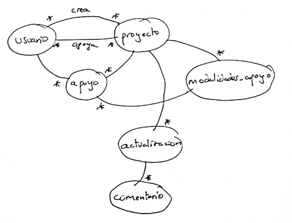

# Práctica evaluable 1: Diseño e implementación de APIs REST

El objetivo de esta práctica es aprender a diseñar correctamente APIs REST. Cada uno podéis elegir el dominio que queráis para la aplicación: una tienda, una red social, un sitio de *crowdfunding*,... 

> Importante: por el momento vamos a diseñar **solamente el API**, no el sitio web. Este se desarrollará en la práctica siguiente. Eso quiere decir que por el momento **no tendremos interfaz de usuario**.

## Paso previo: diseño general del API

### Identificación de los recursos

Debéis identificar los recursos que vais a modelar en el API, que se corresponderán con las entidades del dominio de vuestra aplicación. Por ejemplo en un API para un sitio de *crowdfunding* tendríamos "proyectos". "usuarios", "modalidades de apoyo" (una recompensa que se obtiene cuando un usuario apoya un proyecto con una determinada cantidad), etc. Identificad también los campos de cada recurso. Por ejemplo un proyecto tendrá un título, una descripción, una fecha límite, etc.

Además de identificar los recursos debéis identificar las relaciones entre ellos. Dibujad un grafo que muestre estas relaciones. No es necesario que uséis una notación estándar para las relaciones, ni tampoco que dibujéis con una herramienta gráfica, podéis simplemente dibujar a mano y hacer una foto.

En este ejemplo (cutre, pero no espero que hagáis nada más sofisticado) los arcos indican relaciones y los `*` indican `a muchos`.

### Formulación de los casos de uso simplificados

Con "simplificados" queremos decir que basta con formularlos de forma sencilla en un par de líneas. En nuestro ejemplo del *crowdfunding* serían algo como:

* Un usuario sin estar autentificado debe poder ver los datos más importantes de la lista de proyectos más populares en el sitio
* Un usuario sin estar autentificado debe poder ver todos los datos de un proyecto
* Un usuario autentificado debe poder elegir una modalidad de apoyo y apoyar un proyecto con esa cantidad
* El usuario que ha creado un proyecto, si está autentificado debe poder enviar actualizaciones (==noticias) sobre el estado del mismo
* Un usuario debe poder hacer login en la aplicación
...

Cuestiones importantes sobre los casos de uso:

1. *Las llamadas del API deben estar orientadas a satisfacer los casos de uso, aunque no es necesario que haya una correspondencia 1:1*. Es posible que para resolver un caso de uso hagan falta varias llamadas al API. Por ejemplo es posible que para ver un proyecto incluyendo todas las novedades (*actualizaciones*, en el diagrama) hagan falta dos llamadas al API: una para los datos básicos del proyecto y otra para las actualizaciones. Dependerá si los datos básicos sin actualizaciones o las actualizaciones pueden tener utilidad por sí mismos para otro caso de uso.
2. *No es necesario que implementéis todos los casos de uso (como aparece en los requisitos mínimos)*, así que no os quedéis cortos en este apartado, cuanto más pongáis más os hacéis una idea del potencial y las posibilidades de vuestro API.

La documentación sobre los recursos identificados y los casos de uso **se debe incluir en la entrega** (1-2 páginas, no es necesario más). Además, una vez diseñado el API a partir de esto debéis hacer una correspondencia entre casos de uso y llamadas al API que necesitan (1-2 páginas más máximo).

## Requisitos mínimos de la implementación

Además de la documentación anterior, como mínimo todas las prácticas deben cumplir estos requisitos para poder aprobar. La implementación debe realizarse usando Node y Express. Los requisitos mínimos se valorarán con un 5 y la documentación con 1 punto máximo.

### Implementación de las llamadas al API 

Se deben implementar al menos 7 llamadas distintas al API (más la de autentificación, o *login*, que se describe en el apartado siguiente). Debe haber al menos dos casos de GET (1 de lectura de un recurso sabiendo su `id` y 1 de lectura de una colección), y al menos un caso de POST, PUT y DELETE. Esto nos da 5 llamadas. Las dos restantes pueden ser del tipo que queráis.  

**Se debe realizar un *testing* automatizado (NO manual) de todas las llamadas al API**. Podéis usar las herramientas que deseéis, por ejemplo con [Postman](https://www.getpostman.com/) se pueden [hacer *scripts* para *tests*](https://www.getpostman.com/docs/v6/postman/scripts/test_scripts) con un código JS muy sencillo. La documentación original está en inglés pero también tenéis algún que otro [tutorial](https://medium.com/@cesiztel/c%C3%B3mo-se-hace-api-testing-con-postman-978a521552f4) en castellano.

### Autentificación

El API debe permitir autentificación mediante JSON web token (*se explicará en la clase de teoría del 6 de octubre*). Para ayudaros en la implementación solo podéis usar el paquete [jwt-simple](https://www.npmjs.com/package/jwt-simple) pero no más librerías adicionales.

En el contexto de JSON Web token "hacer login en la aplicación" es realmente "obtener el token". Mapeadlo con una petición POST a la URL que queráis, pasando en la petición HTTP el login y el password en JSON y obteniendo como resultado en *token* en el cuerpo de la respuesta. Esta es una llamada adicional a las otras 7 que debéis implementar.

### Datos estáticos

En principio **los datos pueden ser estáticos, no modificables y estar almacenados en memoria**. Para almacenarlos podéis usar la estructura de datos que queráis. Es decir desde el punto de vista de los datos el API no es más que un *mockup*. 

De este modo las peticiones de tipo GET siempre devolverán los mismos datos fijos y las peticiones que modifiquen datos (POST/PUT/DELETE) devolverán al cliente el código de estado correspondiente pero en realidad no modificarán nada (por ejemplo devolver un 201 si se solicita borrar una entidad aunque en la realidad no se borre y al hacer luego GET siga existiendo. No obstante el API debería comprobar que la operación tiene sentido (por ejemplo devolver un 404 si se intenta borrar una entidad que no existe).

> Para inicializar los datos en memoria o en la BD podéis ayudaros de herramientas como [`faker.js`](https://github.com/marak/Faker.js/), que os permite generar datos como nombres, apellidos, ciudades, etc...con apariencia de "reales".

## Requisitos "adicionales"

Para poder puntuar estos requisitos es necesario haber implementado correctamente los requisitos mínimos. De este apartado podéis elegir los requerimientos que deseéis.

**(2 puntos)** Implementar la persistencia del API con base de datos. **El 6 de octubre veremos en clase de prácticas esta funcionalidad, no empecéis la implementación de esta parte hasta entonces**.Podéis usar para ello la base de datos y las librerías de acceso que queráis. En caso de implementar este apartado no es necesario guardar además los datos en memoria. En el código JS se deben separar aparte las funcionalidades de persistencia, es decir en una función de *routing* de express no debería aparecer código de base de datos, sino estar en funciones o clases aparte. Así, al examinar el código express no deberíamos poder decir qué base de datos estamos usando, ni las funciones de BD deberían contener referencias a express. 

**(1 punto)** Documentar el API usando alguna de las herramientas que se comentarán brevemente en clase de teoría (Swagger, RAML, API Blueprint), o cualquier otra que conozcáis.

**(1 punto)** Que se puedan subir archivos binarios al API y no solo enviar texto. Esto se puede implementar de varias formas. La más común es usando un `Content-Type` en la petición llamado `multipart/form-data`. Por ejemplo en [este tutorial](https://medium.com/@bmshamsnahid/nodejs-file-upload-using-multer-3a904516f6d2) podéis encontrar más información, o podéis simplemente buscar en Google "file upload nodejs multipart". No deberíais necesitar de momento HTML para probar la funcionalidad. En el tutorial referenciado se hace con Postman, pero también podríais buscar en Google cómo hacerlo con Curl u otra herramienta en línea de comandos.

**(1 punto)** Implementar *paginado* en el API. Podéis hacerlo basado en *offset* o en cursores, como queráis. Lo usaréis en el GET que lea una colección de recursos. En el resultado devuelto hay que incluir como metadatos el total de resultados, el número de resultados en la página actual y enlaces a la anterior y la siguiente.

## Plazo de entrega

El plazo de entrega de la práctica concluye el **lunes día 19 de octubre a las 23:55**. La entrega se realizará en moodle enviando un único archivo comprimido en .zip o similar. 

Resumiendo, la calificación será:

- Hasta 5 puntos requisitos mínimos. Es imprescindible que funcionen correctamente para aprobar
- Hasta 1 punto la documentación de casos de uso, relaciones entre recursos,...
- Hasta 4 puntos los requerimientos optativos (elegid los que queráis de entre los propuestos. Podéis proponer cualquier ampliación que se os ocurra aunque no esté en la lista, pero consultadlo antes conmigo para que veamos si es razonable y cuánto se podría valorar en el baremo)

Se entregará:

- Un proyecto Node con un `package.json` con las dependencias. **No debéis incluir el directorio `node_modules`** en la entrega, ya que si las dependencias están especificadas correctamente en el `package.json`, los paquetes se pueden instalar automáticamente con `npm install`.  

- Un archivo con la documentación de casos de uso, de relaciones entre llamadas al API y casos de uso y el diagrama de relaciones entre recursos. Puede ser tan simple como un txt y un png, o un pdf.

