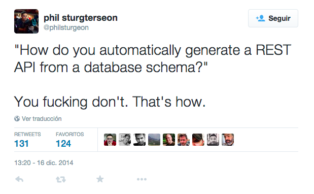

<!-- .slide: class="titulo" -->

# Tema 1
## Introducción a los servicios web REST
# Parte 3
## Diseño de APIs REST

---

## Contenidos

1. REST en detalle
2. Más sobre las consultas
3. Buenas prácticas en el diseño de APIs REST
4. Buenas prácticas a nivel técnico
6. Hipermedia

---

<!-- .slide: class="titulo" -->

# 1. REST en detalle

---

## REST Formalmente

Tiene su origen en [la tesis](www.ics.uci.edu/~fielding/pubs/dissertation/top.htm) de [Roy Fielding](https://twitter.com/fielding),e implica 6 condiciones:

*   Cliente-servidor
*   Interfaz uniforme
    *   Identificación de los recursos
    *   Representaciones estándar
    *   Mensajes auto-descriptivos
    *   Hypermedia as The Engine of The Application State (HATEOAS)
*   Sin estado
*   Cacheable
*   Capas (proxys de modo transparente)
*   Código "bajo demanda" (opcional)


<!-- .element: class="right_vertical_center" -->

---

## Resumen de REST bajo HTTP

Las **llamadas al API** se implementan como **peticiones HTTP**, en las que:

*   La **URL** representa el *recurso*. Cada URL a la que podemos hacer llamadas es lo que se conoce como un *endpoint* del API
*   El **método HTTP** representa la *operación*
*   El **código de estado HTTP** representa el *resultado*
*   Como **formato de intercambio de datos** usaremos algún estándar ampliamente difundido (normalmente JSON por legibilidad y facilidad de manejo desde Javascript)

---

## Leer recurso: la URL

- Habitualmente **todos los recursos de un tipo** se representan con una URL con el nombre del tipo en plural

```http
https://api.github.com/users/
http://graph.facebook.com/me/photos
```

- La URL de **un recurso concreto** debe ser única. Normalmente se obtiene concatenando a la de todos los recursos el `id` del recurso referenciado.

```http
https://api.github.com/users/octocat
http://graph.facebook.com/me/photos/11000003455
```


---

## URLs "jerárquicas"

**Subrecursos**: modelan el lado N de una relación 1-N, o bien uno de los lados en una relación 1-1


```bash
# Un usuario tiene N repos
https://api.github.com/users/octocat/repos
# Un repo tiene N issues
https://api.github.com/repos/octocat/Hello-World/issues
```

---

## Leer recurso: respuesta

- **Algunos estados** posibles: **200** (OK, se devuelve el recurso), **404** (el recurso con dicho `id` no existe),  **401** (credenciales incorrectas), **500** (Error del servidor, p.ej. se ha caído la BD)
- La cabecera `Content-Type` especifica el tipo MIME del formato de los datos

```http
200 OK
Content-Type:application/json

{
  "login": "octocat",
  "id": 583231,
  "avatar_url": "https://avatars.githubusercontent.com/u/583231?v=3",
  ...
}
```

---

## Crear recurso: petición

Típicamente la URL es la de la colección de recursos, ya que el nuevo recurso todavía no tiene un `id` (normalmente lo asigna el servidor)

```bash
# poniendo "user" referenciamos al usuario autentificado en la llamada al API
https://api.github.com/user/repos
```

- El método debe ser **POST** 
- Se debe enviar el nuevo recurso en el cuerpo de la petición
- Se debe enviar la cabecera `Content-Type` con el tipo de datos

```bash
# Cómo enviar la petición usando la herramienta "curl"
# CAMBIAR "mi_usuario_de_github" por el vuestro
curl -v -H "Content-Type: application/json" \
  -X POST \
  -u "mi_usuario_de_github"  \
  -d '{"name":"NuevoRepo","description":"Repo de prueba"}' \
  https://api.github.com/user/repos 
```
Podéis probarlo en [https://repl.it/repls/CanineVelvetyGreyware](https://repl.it/repls/CanineVelvetyGreyware) (cambiar en el `main.sh` el usuario por el vuestro de github y darle al botón "run") 
<!-- .element: class="caption" -->

---


## Crear recurso: respuesta

- **Estados** posibles: **201** (Recurso creado correctamente), **401** (sin autentificar o credenciales incorrectas), **403** (no tienes permiso para esta operación) **400** (petición incorrecta, p.ej. falta un campo o su valor no es válido), **500** (Error del servidor, p.ej. se ha caído la BD)

- En caso de **201** Lo más RESTful es **devolver la URL del recurso creado** en la cabecera HTTP `Location` de la respuesta

```http
201 CREATED HTTP/1.1
Location: https://api.github.com/repos/octocat/Hello-World
```

---

## Actualizar recurso: petición y respuesta

- **URL** del recurso ya existente
- Método HTTP **PUT**
- **Nuevos datos**: según la ortodoxia REST, actualizar significaría enviar TODOS los datos del recurso, incluso los que no cambian.
- **PATCH**: cambiar solo ciertos datos. No está tan difundido como PUT al ser una adición más reciente a HTTP.
- **Resultados posibles**:  **204** (Recurso modificado correctamente, no hay nada que añadir :) ), **404** (recurso no existente), Errores ya vistos con POST (**400**, **401**, **500**, ...)

---

## Eliminar recurso: petición y respuesta

-   URL del recurso a eliminar
-   Método **DELETE**
-   **Resultados posibles**:
    *   204 (Recurso eliminado correctamente, nada que añadir)
    *   Errores ya vistos (400, 401, 403, 404, 500, ...)

   Tras ejecutar el DELETE con éxito, las siguientes peticiones GET a la URL del recurso deberían devolver 404

---

<!-- .slide: class="titulo" -->

# 2. Más sobre las *consultas* 


---


## El problema de la granularidad de los recursos

Supongamos un recurso con subrecursos, por ejemplo los *posts* de un blog con sus comentarios. 

```http
GET http://miapificticiodeblogs.com/blogs/1/posts
```

¿qué hacemos con los subrecursos?

- ¿Si el cliente los necesita, que los solicite aparte?
- ¿Los devolvemos junto con el recurso principal?

---

## Opción 1: "Ignorar" los subrecursos

Si el cliente necesita habitualmente los subrecursos junto con el recurso principal tenemos un [problema de tipo "N+1"](https://www.infoq.com/articles/N-Plus-1)

- 1 petición para listar el recurso principal (p.ej. los datos básicos de cada post: título, texto )
- N peticiones para solicitar la lista de subrecursos para cada instancia del principal (los comentarios de cada post)

---

## Opción 2: Subrecursos "embebidos"

Si el caso de uso más habitual es necesitar los subrecursos junto con el recurso "principal" podemos incluirlos en la respuesta

```javascript
[
  { "id": 1,
  "titulo": "Bienvenidos a mi blog",
  "comentarios": [
     {"id": 1, "texto": "primero en comentar!!"},
     {"id": 5, "texto": "los blogs se han pasado de moda..."}
  ]}
  {"id":2,
    ... }
]
```

Problema: si en algún caso no los necesitamos, malgastamos ancho de banda. 

---

## Granularidad de los recursos en REST 

Como podemos ver, el problema es que **la granularidad de los recursos en REST es fija**, no hay ningún mecanismo de *query* para poder decir qué datos de un recurso o qué subrecursos queremos y cuáles no

---


En general, **no hay una solución siempre mejor**. La solución apropiada la determinarán los casos de uso típicos del API

Por ejemplo, el API de Github incluye algunos datos sobre el **propietario** cuando accedemos a un **repositorio**, el de Spotify al acceder a un **album** incluye bastantes datos sobre las **pistas**,...

Este es un ejemplo de que **las peticiones al API no tienen por qué reflejar la estructura de la BD subyacente**


---

## Algunas extensiones no estándar a REST

- Especificar los subrecursos que queremos obtener
- Seleccionar los datos del recurso que queremos obtener
- Recuperar varios recursos simultáneamente

---

Algunos APIs permiten controlar qué subrecursos queremos "embeber". Esto no es estándar en REST

```bash
# Esta sintaxis es propia del Graph API de Facebook
# junto con el usuario autentificado obtenemos sus últimas 5 fotos y sus últimos 5 posts
https://graph.facebook.com/me?fields=photos.limit(5),posts.limit(5)
```

Esta idea llevada "al extremo" nos lleva a otros "paradigmas" de diseño de APIs como GraphQL, que ya veremos

---

## Respuestas parciales

- Muchas veces un recurso contiene **campos que no necesitamos**, ya que en REST "estándar" siempre se obtiene la **representación completa** del recurso
- Algunos APIs "un poco más allá" de REST permiten seleccionar **solo los campos que necesitamos**.

```bash
# Sintaxis propia del Grah API de Facebook
https://graph.facebook.com/JustinBieber?fields=id,name,picture
# No creo que Justin Bieber esté en linkedin pero la sintaxis es real
https://api.linkedin.com/v1/people/JustinBieber:(id,num-connections,picture-url)
```


---

## Recuperar varios recursos a la vez

Algunos APIs permiten recuperar varios recursos de una lista, reduciendo así el número de peticiones. Esto no está previsto en REST "estándar" pero es útil en ciertos casos

Ejemplo: en el API de Spotify se puede obtener información de varios álbumes con una sola petición pasando como parámetro HTTP una lista de ids separados por comas

```bash
# los ids reales son mucho más largos
https://api.spotify.com/v1/albums?ids=111Ab31,2GFg2222,3333Tg7f
# Nótese que el "endpoint" para un solo álbum es distinto
https://api.spotify.com/v1/album/111Ab31
```


---

## Filtrar colecciones

- Es poco habitual obtener **todos** los elementos de un tipo, es más común
  + Filtrar resultados especificando condiciones
  + Paginar los resultados, limitando así su número
- Ambos casos se suelen representar con una *query string* (grupo de parámetros HTTP precedido de `?`)

```http
http://mislibros.com/libros?titulo_contiene=tronos&autor_contiene=Martin
https://graph.facebook.com/JustinBieber/photos?offset=5&limit=2
https://api.github.com/users/octocat/repos?page=2&per_page=5
```


---

En algunos APIs como el de Github, la búsqueda se hace mediante URLs especiales

```bash
# buscar todos los repositorios con la palabra clave "node"
https://api.github.com/search/repositories?q=node
```

Esto no es nada REST (¡Un verbo en una URL!), pero qué le vamos a hacer, se ve por ahí

---

## Paginación basada en offset

- Suponiendo que los resultados están ordenados, especificamos la *cantidad* deseada y el *offset* (a partir de qué dato queremos)
- Los parámetros son propios de cada API (`page`&`per_page`, `page`&`count`, `offset`&`limit`...) normalmente el significado es fácil de deducir por el nombre

```http
https://gateway.marvel.com:443/v1/public/characters?limit=10&offset=0
```

- La respuesta suele contener **metadatos** con página actual, total, etc.

```javascript
{   "offset": 0,
    "limit": 10,
    "total": 1491,
    "count": 10,
    "results": [
      {
        "id": 1011334,
        "name": "3-D Man",
        "description": "",
        "modified": "2014-04-29T14:18:17-0400",
        "thumbnail": {
          "path": "http://i.annihil.us/u/prod/marvel/i/mg/c/e0/535fecbbb9784",
          "extension": "jpg"
        }
        ...
      }
        ...
      ]
}
```

---

## Problemas de la paginación por offset

- En SQL, las consultas con un *offset* grande son ineficientes (la BD tiene que leer y descartar las filas)
- En datos que puedan cambiar en tiempo real, añadir/eliminar datos puede significar que se dupliquen/eliminen resultados


---

## Paginación con cursores

- Inicialmente el cliente pide solo una cantidad de datos. En la respuesta viene un **cursor**: identificador único que marca un dato concreto de la lista. 
- En cada respuesta se envía generalmente un cursor para ir "atrás" y otro para "adelante"

```json
{
  "data": [
     ... aquí estarían los datos en sí de lo que hemos pedido
  ],
  "paging": {
    "cursors": {
      "after": "MTAxNTExOTQ1MjAwNzI5NDE=",
      "before": "NDMyNzQyODI3OTQw"
    },
    "previous": "https://graph.facebook.com/me/albums?limit=25&before=NDMyNzQyODI3OTQw",
    "next": "https://graph.facebook.com/me/albums?limit=25&after=MTAxNTExOTQ1MjAwNzI5NDE="
  }
}
```

Problema: el cliente no puede saltar a una página concreta, solo ir adelante y atrás


---

En cuanto a la **implementación** el cursor puede ser un *timestamp*, un *id* o similar, que permita ordenar e indexar los datos y que nos asegure de que no van a aparecer datos nuevos "por enmedio"

Ejemplo: algunos *endpoint* del graph API de FB usan *timestamp* UNIX con los parámetros `since` o `until`

```http
https://graph.facebook.com/me/feed?limit=25&since=1364849754"
```

Cursores "opacos": internamente pueden ser *timestamp*, *id* o lo que sea (combinación de ambos, p.ej.) pero al cliente no le importa. Además evita que el cliente "haga trampas" usando valores "inventados" para los cursores

```http
https://graph.facebook.com/me/albums?limit=25&after=MTAxNTExOTQ1MjAwNzI5NDE=
```

---

<!-- .slide: class="titulo" -->
# 3. Buenas prácticas en el diseño de APIs 


---

## Algunas buenas prácticas

Primero: los usuarios del API son los **desarrolladores** que van a implementar *apps* o webs que llamen al API, no los usuarios finales de las *apps* o de las webs

- **Consistencia** en el diseño del API, no "sorprender" al usuario
- Centrarse en los **casos de uso**
- **Formalizar la API** antes de implementarla (diseño por contrato, *design first*)

Así especificadas son aplicables al diseño de cualquier tipo de API, no solo REST

---

## No sorprender al usuario

Seguir en lo posible las **convenciones estándar** (en nuestro caso, REST)

Pregunta: ¿Qué convenciones REST **no** se están respetando en esta llamada al API "REST" de Twitter que borra un tweet dado su *id*?


De la [documentación del API de Twitter](https://dev.twitter.com/rest/reference)
<!-- .element: class="caption" -->


---

El objetivo no es ser puristas REST ([Restafarians](https://www.ben-morris.com/the-restafarian-flame-wars-common-points-of-disagreement-over-rest-api-design/)) solo por esnobismo, es para facilitar la vida a los usuarios del API


---

## Centrarse en los casos de uso

El API debe **facilitar los casos de uso típicos**, no ser un reflejo del funcionamiento interno del sistema, ni de la base de datos



---

## Especificación formal de APIs REST

Existen varios lenguajes especialmente creados para **especificar APIs REST** que en general nos permiten:

- Obtener la especificación formal antes de implementar
- Generar automáticamente un servidor *mock* a partir de la especificación
- Validar automáticamente que la implementación cumple con la especificación
- Generar un esqueleto de implementación para servidor o cliente 
- Documentar automáticamente el API si ya está implementado

---

## Algunos lenguajes de especificación

<div class="row clearfix">
    <div class="column third">
      
      <a href="https://apiblueprint.org/" class="caption">API Blueprint]</a>
    </div>
    <div class="column third">
       
      <a href="https://swagger.io/" class="caption">Swagger</a>
    </div>
    <div class="column third">
         
      <a href="https://raml.org/" class="caption">RAML</a>
      <a href="http://static-anypoint-mulesoft-com.s3.amazonaws.com/API_examples_notebooks/raml-design3.html" class="caption">Ejemplo de API</a>
      </div>
</div>


---

## Ejemplo con API Blueprint

```markdown
FORMAT: 1A

# Lista de la compra

API muy sencillo para manejar una lista de la compra

# Group Items

Los productos que hay en la lista de la compra

## Lista de Items [/items]

### Listar todos los items [GET]
+ Response 200 (application/json)

        [ 
           {"nombre":"Patatas", "cantidad":"1kg"},
           {"nombre":"leche", "cantidad":"1L"}
        ]

### Añadir item [POST]

+ Request (application/json)

        {"nombre":"vino", "cantidad":"1 botella"}
        
+ Response 201 (application/json)

    + Headers

            Location: /items/1
```

Hay [muchas herramientas](https://apiblueprint.org/tools.html) que trabajan con este formato, por ejemplo [https://getsandbox.com/](https://getsandbox.com/)

---


<!-- .slide: class="titulo" -->

# 4. Más "buenas prácticas" a nivel técnico

---

## Versionar el API

- Si las URL y las llamadas se mantienen igual entre versiones del API pero cambiamos su comportamiento, "romperemos" los clientes
- Necesitamos que el cliente pueda **especificar a qué versión del API está llamando**

Solución 1: "incrustar" el número de versión en la URL

```http
https://graph.facebook.com/v2.5/me
https://api.twitter.com/1.1/search/tweets.json
```

Solución 2: (Ortodoxia REST): el cliente envía la cabecera `Accept` indicando qué versión del API quiere. Usada por ejemplo por el API de Github

```http
//con esto indicamos que queremos usar la versión 3 del API y queremos JSON
Accept: application/vnd.github.v3+json
```

---

## Generar los id de los recursos

- **Autonuméricos** de la BD. Solución sencilla, pero puede dar problemas si tenemos más de un servidor de BD para repartir la carga (*shard*)
- **UUIDS**: podemos "asegurar" que son únicos aunque se generen desde distintas instancias de servidor

```javascript
//https://repl.it/LQjU
var uuid = require('uuid/v1')
console.log(uuid())   //176c8ba0-9cb6-11e7-abab-7df31ea5be22
```

---

## "Negociación" de contenido

- Hace unos años, todos los APIs devolvían solo XML, ahora casi todos usan solo JSON


- Si queremos que nuestro API admita y sirva varios formatos de datos, se considera una buena práctica que cliente y servidor puedan "**negociar**" el formato más adecuado para ambos


---

## Cómo negociar el formato según la ortodoxia REST

- Cliente -> servidor: cabecera `Accept` en la petición
```http
Accept: application/json;q=1.0, application/xml;q=0.5, */*;q=0.0
```

- Servidor -> cliente: 
  - Si no se han podido satisfacer las preferencias, código de estado `406 NOT ACCEPTABLE`
  - Indica el formato que ha enviado con la cabecera `Content-Type`

---

## Cómo se negocia el formato en el "mundo real"

Depende del API, en algunos se hace con **parámetros HTTP**, en otros es **parte de la URL** (generalmente como si fuera una extensión de archivo: `.xml`, `.json`,...)


```http
https://api.twitter.com/1.1/search/tweets.json
https://api.flickr.com/services?format=XML...
```


---

<!-- .slide: class="titulo" -->
<!-- .slide: id="sect_hipermedia" -->

# 5. Hipermedia en APIs REST


---

## Problema: dependencia de las URL

*   Tal y como hemos implementado hasta ahora los servicios REST, para realizar una operación necesitamos **conocer previamente la URL** del recurso
*   Esto presenta el problema de que **no podemos modificar las URL** sin "romper" los clientes actuales

---


## HATEOAS

**H**ypermedia **A**s **T**he **E**ngine **O**f **A**pplication **S**tate

Imitar el funcionamiento de la web, en la que para seguir los pasos en un flujo de trabajo vamos saltando entre enlaces, sin necesidad de conocer previamente las URL

<!-- .element: class="r-stretch" -->

---

## Hipermedia en REST

- En cada respuesta debemos incluir enlaces con las **operaciones** posibles y los **recursos** directamente relacionados
- Aunque en JSON no hay un tipo de datos URL, hay formatos más o menos difundidos para representar vínculos, por ejemplo [HAL](http://stateless.co/hal_specification.html)

```javascript
{
  "id":"1",
  "items": [
    {"id":"12", "cantidad":"1"},
    {"id":"1123", "cantidad":"2"}
  ]
  "_links": {
    "self": {
       "href": "http://miapi.com/pedidos/1"  
    },  
    "items": {
      "href": "http://miapi.com/pedidos/1/items"  
    },
    "pagar": {
      "href": "http://miapi.com/pagos/pedidos/1"  
    }
  }
}
```

---

La idea de HATEOAS es que al final el API es como una máquina de estados y pasamos de un estado a otro haciendo peticiones

 <!-- .element: class="r-stretch" -->

---

## Paginación

Es un ejemplo apropiado para hipermedia, ya que es recomendable incluir **vínculos** a los datos de (al menos) la página anterior y siguiente

```javascript
{
    "_links": {
        "self": {
            "href": "http://example.org/api/books?page=3"
        },
        "first": {
            "href": "http://example.org/api/books"
        },
        "prev": {
            "href": "http://example.org/api/books?page=2"
        },
        "next": {
            "href": "http://example.org/api/books?page=4"
        },
        "last": {
            "href": "http://example.org/api/books?page=133"
        }
    }
    "count": 2,
    "total": 498,
    "data": {
        { title: "Canción de hielo y fuego", author: "George R.R. Martin"}
        { title: "A vuestros cuerpos dispersos", author: "Philip J. Farmer"}
    }
}
```

---

<!-- .slide: class="titulo" -->

# ¿Alguna duda?


