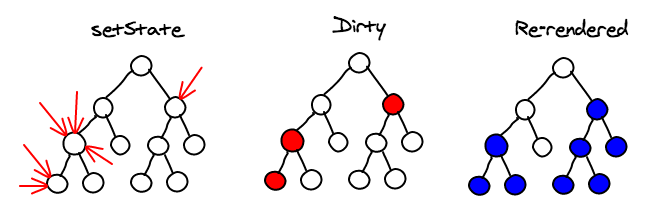

<!-- .slide: class="titulo" -->

# Tema 3: *Frameworks* JS en el cliente
## Parte III: Reactividad y _rendering_

---

<!-- .slide: class="titulo" -->

## Reactividad

---

Aunque **reactividad** es un término bastante amplio que tiene distintos significados en distintos contextos, en el contexto de los *frameworks* JS se suele entender como:

- **cambiar automáticamente el valor de una variable** cuando esta depende de otra
- **repintar la vista automáticamente cuando cambia el estado** del componente 

---

Se suelen distinguir dos tipos de reactividad:

- **Tipo *pull***: hay que llamar a un método para actualizar el estado, que a su vez "repinta" la vista. Por ejemplo: React, Svelte 2, Angular (aunque este último llama al método automáticamente por ejemplo en manejadores de evento)
- **Tipo *push***: al cambiar los datos se repinta la vista automáticamente. Ejemplos: Vue, Svelte 3, Knockout

---


## Ejemplos de reactividad tipo "pull"

- [Ejemplo de código "de juguete"](https://jsbin.com/cozigix/2/edit?html,js,console,output) 
  - Para probarlo escribir en la consola `setState({contador:0}`. A partir de ahí se puede usar el botón (que llama a `setState`) 
- [Ejemplo con el framework React](https://codepen.io/darylw/pen/vzKQNp?editors=0010) (podéis ver que la idea es la misma)


---

## Reactividad tipo "pull" 

Implementación _naive_ y muy simplificada

```javascript
var update, state

//función a la que hay que pasar qué hacer cuando cambie el estado
var onStateChanged = function(update_fn)  {
  update = update_fn
}

//función que sirve para cambiar el estado
var setState = function(newState) {
  state = newState
  update()
}

//decimos: "cuando cambie el estado, queremos repintar la vista"
onStateChanged(function () {
  var view = render(state)
})
```


---

## *Pull* en una jerarquía de componentes

- Normalmente una *app* es un árbol de componentes
- El *framework* repintará todos los nodos por debajo de los que han cambiado el estado
- Para aumentar la eficiencia, se suele permitir a un nodo indicar si debería o no ser repintado (el desarrollador debe escribir código para eso, en React implementar `shouldComponentUpdate()`)



[Fuente](https://calendar.perfplanet.com/2013/diff/) <!-- .element: class="caption" -->

---

## Reactividad tipo *push* en Vue

Vue convierte las propiedades del estado de un componente en *getters* y *setters*

```javascript
let data = { price: 5, quantity: 2 }
    
Object.keys(data).forEach(key => { 
  let internalValue = data[key]
  Object.defineProperty(data, key, {
    get() {
      console.log(`Getting ${key}: ${internalValue}`)
      return internalValue
    },
    set(newVal) {
      console.log(`Setting ${key} to: ${newVal}` )
      internalValue = newVal
    }
  })
})
total = data.price * data.quantity
data.price = 20
```
[Código en JSBin](https://jsbin.com/sakikiy/edit?js,console,output)<!-- .element class="caption" --> | 


[Tomado de "Build a reactivity System", del curso "Vue Mastery"](https://www.vuemastery.com/courses/advanced-components/build-a-reactivity-system/) <!-- .element class="caption" -->

---

## Reactividad tipo *push* en Vue (II)

De manera muy simplificada:

-  Cuando se llama a un *getter* Vue registra la dependencia
- Cuando se llama a un *setter* Vue dispara el repintado de la vista

<!-- .element: class="stretch" -->

---

[Ejemplo de código de reactividad push](https://jsbin.com/hubecop/5/edit?html,js,output) 

(el código es un poco retorcido, pero podéis probar cómo funciona clicando en el botón, que hace simplemente `state.contador = state.contador + 1`)

---

## *Push* en una jerarquía de componentes

- Como el *framework* lleva la pista de las dependencias, solo repinta los nodos cuyas dependencias han cambiado
- Aún así eso no implica que realmente fuera necesario repintarlo, quizá el HTML resultado sería el mismo que antes...


---

## Reactividad tipo _push_ en Svelte 3

Svelte sigue un enfoque distinto, en lugar de hacer "la magia" en *runtime*, es un **compilador** que genera "código reactivo"

[Demo de la charla "Rethinking reactivity de Rich Harris"](https://rethinking-reactivity.surge.sh/#slide=21)


---

<!-- .slide: class="titulo" -->

## *Rendering*

---


El *framework* debe permitirnos especificar cómo será la vista en función de los datos

```
vista = f(datos)
```

Aunque podríamos hacer muchas más diferencias hay *frameworks* que usan un lenguaje de **_templates_** (p.ej Angular, Svelte, Vue _en apariencia_) y otros usan directamente **Javascript** (p.ej React)

---

## Lenguajes de templates

- Problema: nos vemos limitados a la expresividad del lenguaje
- Ventaja: Los *framework* suelen incluir un *compilador* de *templates* que puede optimizar la detección de cambios para el repintado

```html
<div id="content">
  <p class="text">Lorem impsum</p>
  <p class="text">Lorem impsum</p>
  <p class="text">{{mensaje}}</p>
  <p class="text">Lorem impsum</p>
  <p class="text">Lorem impsum</p>
</div>
```

En el ejemplo, solo puede cambiar el tercer `<p>`, así que **para repintar el componente *como mucho* solo hace falta repintar ese `<p>`**


---

## Javascript para definir *templates*

- En React: `React.createElement(<tag>, <atributos>, <hijos>)`
- Luego veremos por qué no se usan directamente las funciones del DOM del mismo nombre. Por ahora podemos suponer que hacen lo mismo

```javascript
//esto es como la "f" de vista=f(datos) 
function HelloReact(props) {
  return React.createElement("div", null, 
            React.createElement("h1", null, props.saludo), 
            React.createElement("p", null, "Welcome to React"));
}
//maquinaria necesaria para pintar el componente React en la página
const element = &lt;HelloReact saludo="Ehh!!"/&gt;
ReactDOM.render(
  element,
  //suponiendo que exista un tag con id="mountNode"
  document.getElementById('mountNode')
);
```
[Probar ejemplo](https://jscomplete.com/playground/s357745)

---

El ejemplo anterior puede parecer tedioso (¡y lo es!), pero usar JS para la función de *render* tiene la **ventaja** de que **podemos usar toda la expresividad de JS**

```javascript
//Aclaración: nadie programa así en React, normalmente se usa un formato llamado JSX,
//que permite poner las etiquetas en el JS y es mucho más legible
function Ejemplo(props) {
    const c = React.createElement
    const children = []
    for(var i=0; i<5; i++) {
        children.push(c('p', {class:'text'},
                       i == 2 ? props.mensaje : 'Lorem ipsum'))
    }
    return c('div', {id:'content'}, children)
}

const element = &lt;Ejemplo mensaje="Hola amigos" /&gt;
ReactDOM.render(
  element,
  document.getElementById('mountNode')
);
```

[Probar ejemplo](https://jscomplete.com/playground/s357763)

---

**Problema**: el lenguaje es tan expresivo que el *framework* no puede analizar qué estamos haciendo y no puede optimizar tanto el proceso de repintado.

Como hemos visto en los ejemplos, el desarrollador lo programa como si se repintara todo el árbol (*como los gráficos de un juego que se repintan enteros n veces por segundo*) 

¿Cómo reducir entonces el coste del repintado?

---

## DOM virtual

- Idea introducida por React
- La función `React.createElement` no genera nodos del DOM real, sino nodos en memoria (en un "árbol DOM virtual"), con un API más rápido
- En cada *render* se hace una especie de *diff* entre el DOM virtual actual y el anterior (denominada en React ["reconciliation"](https://reactjs.org/docs/reconciliation.html). Según la documentación de React el coste es lineal con el número de nodos
- **Solo se repintan en el DOM real los nodos que cambian**. 


---

[Ejemplo de reconciliation](https://codepen.io/ottocol/pen/QWWVWPa?editors=1010)

Para verlo hay que abrir la consola de desarrolladores del navegador, ir a ver el código fuente en "tiempo real" (pestaña "Elements" en Chrome, "Inspector" en Firefox) y buscar el div con id="root". Pese a que en el código de la función de render se repinta el componente entero, en el navegador solo se está cambiando un nodo.

---

## Vue y el Virtual DOM

- Curiosamente, aunque Vue usa plantillas para describir el HTML de los componentes, estas internamente se comportan como funciones JS, de hecho podemos escribir la función render() si las plantillas "se nos quedan pequeñas"
- Es por esto que Vue también usa un DOM virtual
- Por el contrario, frameworks como Svelte no lo necesitan

---


## Referencias

- 📺 [dotJS 2016 - Evan You - Reactivity in Frontend JavaScript Frameworks](https://www.youtube.com/watch?v=r4pNEdIt_l4)
- 📺 [Evan You on Vue.js: Seeking the Balance in Framework Design | JSConf.Asia 2019](https://www.youtube.com/watch?v=ANtSWq-zI0s)
- 📺 📄[Svelte 3: Rethinking reactivity](https://svelte.dev/blog/svelte-3-rethinking-reactivity)